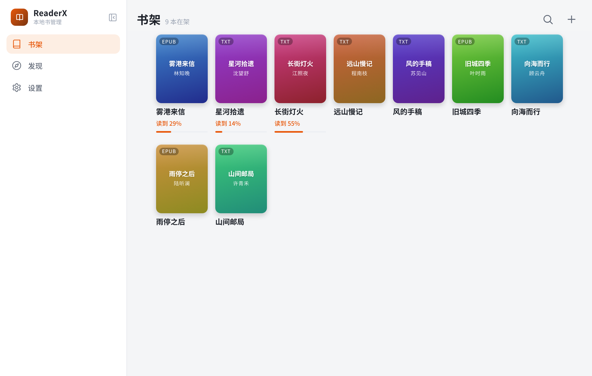

<p align="center">
  
</p>

<p align="center">
  <a href="https://github.com/zilorn/readerx/releases/latest"></a>
  
  
  
  
  <a href="./LICENSE"></a>
</p>

<p align="center">
  <b>简体中文</b> | <a href="./README.en.md">English</a>
</p>

# ReaderX

基于 **Tauri 2 + SolidJS + TypeScript** 的电子书阅读器，支持 **Android、Linux 和 Windows**，共用同一套页面与本地书库。

[下载最新版本](https://github.com/zilorn/readerx/releases/latest)

## 界面预览

截图使用虚构演示数据。

<p align="center">
  
  
</p>

<p align="center">
  
</p>

## 功能

- **本地书库**：导入 TXT / EPUB / MOBI / PDF，支持书架分组、阅读进度与书签。
- **阅读与听书**：章节目录、字号调整、浅色 / 深色 / 护眼主题；桌面宽窗口双页阅读；原生 TTS 与自定义 HTTP 语音源、倍速及定时停止。
- **书源**：搜索与分类发现、在线阅读及离线下载；支持 JS 规则、JSON 导入导出、分组与批量管理、编辑测试和网页登录认证。
- **同步与备份**：局域网设备间同步书籍、进度、书签与规则，无需账号；整库 ZIP 备份，支持合并导入或覆盖恢复。
- **个性化**：自定义分章与文本替换规则，界面支持简体中文和 English。

Android 使用底部导航；桌面窗口宽度 ≥900px 时使用侧边导航，窄窗口自动切回手机布局。

## 开发

需安装 pnpm 与 [Tauri 开发依赖](https://v2.tauri.app/start/prerequisites/)。

```bash
pnpm install
pnpm dev                 # 网页预览：http://localhost:1420，仅用于调试界面
pnpm tauri dev           # 桌面应用
pnpm tauri android dev   # Android 真机 / 模拟器
```

检查与构建：

```bash
pnpm exec tsc --noEmit
pnpm run i18n:check
pnpm build
```

端口 1420 已被占用时，请复用现有开发服务器。Rust 测试需在 `src-tauri/` 中运行。

## 文档与贡献

| 文档 | 内容 |
| --- | --- |
| [书源教程](./docs/book-source-guide.md) · [格式规范](./docs/book-source-spec.md) · [API](./docs/book-source-api.md) | 编写与调试书源 |
| [网页认证](./docs/cloudflare.md) · [书源 CLI](./docs/book-source-cli.md) | 登录、Cloudflare 与独立命令行工具 |
| [同步](./docs/sync.md) · [备份](./docs/backup.md) | 数据同步与恢复 |
| [日志与排障](./docs/logging.md) | 设置 → 调试 → 应用日志 |
| [多语言](./docs/i18n.md) · [协作约定](./AGENTS.md) | 开发规范 |
| [贡献指南](./CONTRIBUTING.md) | 问题反馈、功能建议与 Pull Request |

## 书源使用声明

ReaderX 及其作者尊重著作权及其他知识产权。书源仅用于接入有权访问和使用的内容；公开可访问不代表获得复制、下载或传播授权，请遵守法律法规及权利人的授权范围。

社区及第三方书源由其作者制作和维护，与 ReaderX 项目及作者无关。书源在本地沙箱中运行，但项目无法保证其安全性，请仅导入可信来源的书源，并阅读导入与启用提示。
